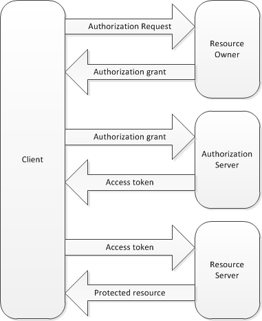

# OAuth1 for JIRA

## Summary of the steps

An oauth connection is established between a JIRA server and a user of a **local application**.

As a JIRA administrator:
1. Choose an arbitrary `Consumer Key` to identify the **local application**.
2. Generate a `Public Key` / `Private Key` pair.
3. Create an `Application Link` in JIRA to save the `Consumer Key` / `Public Key` secret for future oauth connections.

As a JIRA user:
1. Start the oauth dance to get a personal `OAuth Token` and `OAuth Token Secret`.
2. Get the `oauth header` for a given `url` and `method` (plus other above secrets).
3. Then immediately request JIRA for the given `url` / `method` with the provided `oauth header`.

## Application settings

As a JIRA administrator...

### Consumer Key

Any arbitrary name which is shared between the application and the JIRA server.

Example: myapp-mycompagny

### Public and Private keys

```bash
openssl genrsa -out consumer.pem 1024 # private key rsa-key.pem
openssl rsa -in consumer.pem -pubout -out consumer.pub # public key rsa-key.pub
```

### Application Link

Got to JIRA ADMINISTRATION > Applications > Application links

Enter the URL of the application you want to link = https://myapp.mycompagny

Keep this URL even if no response and Continue with these parameters:
- Application Name = Any arbitrary name
- Application Type = `Generic Application`
- Service Provider Name = Any arbitrary name
- Consumer key = Any arbitrary name
- Shared Secret = Any arbitrary name
- Request Token URL = https://myapp.mycompagny
- Access token URL = https://myapp.mycompagny
- Authorize URL = https://myapp.mycompagny
- Create incoming link = `ticked`

Then Continue with these other parameters:
- Consumer Key = `<the Consumer Key defined above>`
- Consumer Name = Any arbitrary name
- Public Key = `<content of consumer.pub>`

## Node applications

As a JIRA user...

### oauth dance: OAuth Token and OAuth Token Secret

The `npm` module `oauth` provides the following functions:
1. `new OAuth().getOAuthRequestToken()` requests for a new `Token / Secret` then redirects to JIRA authorization URL.
2. (Here JIRA redirects to the provided callback URL after you allowed or denied the access request)
3. `new OAuth().getOAuthAccessToken()` requests for a new `Access Token / Secret` aka `OAuth Token` / `OAuth Token Secret`.

These functions need the following parameters to post the data in JIRA:
- baseUrl of the JIRA server
- consumerKey aka consumerAppKey
- consumerSecret aka consumerPrivateKey

#### Configuration of the node application

A local node server executes the `oauth` dance. This needs the `npm` modules `express` and `express-session` too.

```bash
npm install # install express, express-session, nconf, oauth
```

Copy the `consumer.pem` into `cfg/`. This is the consumerSecret aka consumerPrivateKey.

Create the `jira-config.json` file with this content into `cfg/` too.

```javascript
{
  "jiraUrl": "<baseUrl>",
  "consumerKey": "<the Consumer Key defined above>"
}
```

#### Start the node application

Then start the node server for the oauth dance.

```bash
# We launch the node server for the oauth dance
NODE_TLS_REJECT_UNAUTHORIZED=0 node src/createOAuth1Token.js
```

First verify the node server at http://localhost:1337.

Then start the oauth dance at http://localhost:1337/jira.
This will start this Oauth Workflow:



<pre>
      | `new OAuth().getOAuthRequestToken()` ==> POST data at `oauth/request-token` URL in JIRA            |
      |                     Error `Unknown Consumer Key` or new `Token / Secret` pair <== Answer from JIRA |
      |                                                                                                    |
      | `new OAuth().getOAuthRequestToken()` callback ==> Redirects to `oauth/authorize` URL in JIRA       |
      |                            You should click on the buttons to `Allow` or `Deny` the access request |
      |        `oauth_verifier` in the callback URL is either `denied` or a valid key <== Answer from JIRA |
      |                                                                                                    |
      | `new OAuth().getOAuthAccessToken()` ==> POST data at `oauth/access-token` URL in JIRA              |
      |                    Error `Token Rejected` or new `Access Token / Secret` pair <== Answer from JIRA |
</pre>

Once completed the oauth process gives you `OAuth Token` and `OAuth Token Secret`.

### oauth header: Input for the curl command

The `npm` module `oauth` has a function `new OAuth().authHeader()`.

This function needs the following parameters to calculate the oauth header:
- url eg <jiraBaseUrl>/rest/api/2/myself
- method ie GET, POST, PUT, DELETE, etc.
- consumerKey aka consumerAppKey
- consumerSecret aka consumerPrivateKey
- oauthToken
- oauthTokenSecret

#### Configuration of the node application

Keep the `consumer.pem` into `cfg/`. This is the consumerSecret aka consumerPrivateKey.

Update the `jira-config.json` file with this content into `cfg/` too.

```javascript
{
  "jiraUrl": "<baseUrl>",
  "request": "api/2/myself",
  "method": "GET",
  "consumerKey": "<the Consumer Key defined above>",
  "oauthToken": "<token received in first node application>",
  "oauthTokenSecret": "<token secret received in first node application>"
}
```

#### Start the node application

Try `src/getOAuth1Header.js` alone.

```bash
# prints "Authorization:${oauthHeader}"
node src/getOAuth1Header.js # with default values from jira-config.json
node src/getOAuth1Header.js --request "api/2/priority" # another request
node src/getOAuth1Header.js --request "api/2/issue" --method "POST" # a POST request
```

This will print a `oauth header` like:

> Authorization:
>   `OAuth`
>   `oauth_consumer_key`="myapp-mycompagny",
>   `oauth_nonce`="lIe9y6RMbKSoUyFK91feMOFW0kvi43xf",
>   `oauth_signature_method`="RSA-SHA1",
>   `oauth_timestamp`="1515670657",
>   `oauth_token`="KD8mwWNHoJhWeZh9ojvj9D4xI0EfUTtN",
>   `oauth_version`="1.0",
>   `oauth_signature`="p8BKDvwOBM6B3GMlMdrGcnqw7TfiRR5XtAGsQTbbJaqO%2Fn3JdFkPMnT2pe34PyjmxN26XOdZdV7JeZgoKe0wqTQX1v%2F13EA%2BioxZB5uBZo%2Bz0IJkbyF8ZQsXfXcQsY9fJntvEbrRZ2A94UWu2WS3vZ1L1tRavvsu04zLJZS%2BljA%3D"

## Curl command

As anyone knowing the secrets...

Run the `curl` command with `src/getOAuth1Header.js` as parameter.

```bash
# Common parameters: $request is used twice in the curl command
jiraUrl=<jiraBaseUrl>
request=api/2/myself

# Curl command
curl "$jiraUrl/rest/$request" -H "$(node src/getOAuth1Header.js --request=$request)" -H "Accept:application/json"
```
